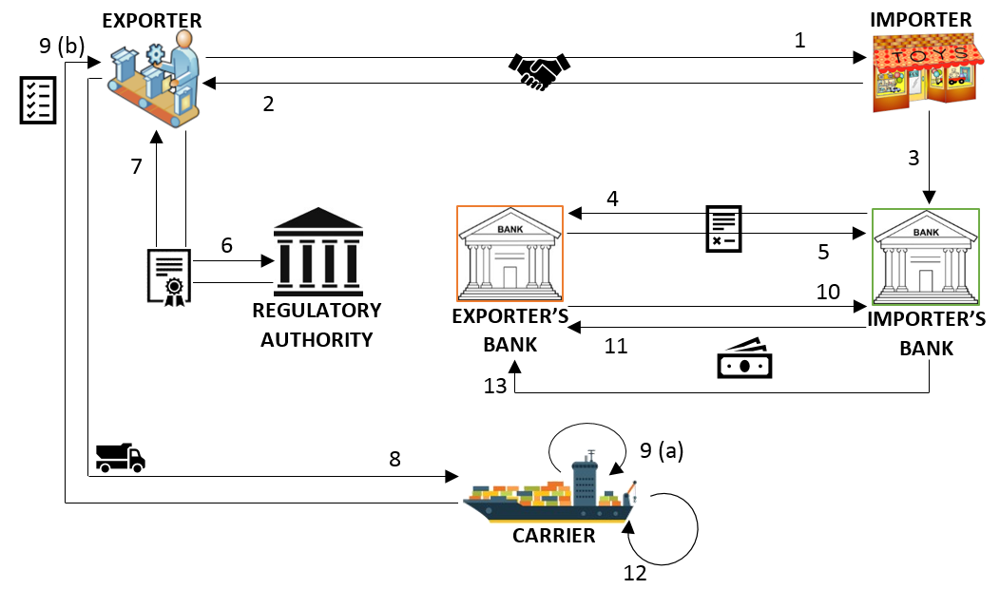

# Trade Application
This is a use case on trade finance and logistics, designed to demonstrate the capabilities of Hyperledger (mainly Fabric) blockchain tools.

# Use Case Scenario Overview
The trade scenario consists of 6 participants:
- *Exporter*: An entity that is selling goods
- *Importer*: An entity that is buying goods from an exporter in exchange for money
- *Importer's Bank*: Maintains a bank account for an importer, and issues a Letter of Credit on its behalf
- *Exporter's Bank*: Maintains a bank account for an exporter, and handles L/Cs and payments on its behalf
- *Carrier*: Entity that ships goods from exporter's to importer's location.
- *Regulatory Auhority*: Public or governmental body that approves the export of goods, and audits the process

The flow diagam below illustrates the steps from a trade agreement to the final payment settlement.
(For more details, see the [full description](docs/Use-Case-Description.docx).



# Application folder structure
```
./
├── chaincode
├── middleware
└── application
└── composer
└── network
└── docs
└── README.md
```
The [chaincode](chaincode) folder contains the source code for all versions of the chaincode.

The [middleware](middleware) folder contains wrapper functions that use the Fabric SDK library to implement channel and chaincode operations.

The [application](application) folder contains code to start a web server and offer a REST API for users to register, login,
set up the channel and application, and run trade operations.

The [network](network) folder contains configurations and code to launch a single-machine Docker network setup corresponding to a minimal
version of the trade application scenario.

The [docs](docs) folder contains more documentation on the use case.

# Testing and Running the Application
To test and run the complete application, you will need to perform the following steps in sequence:
- **Test the chaincode (smart contract)**: Navigate to the [chaincode](chaincode) folder for instructions.
- **Launch a trade network**: Navigate to the [network](network) folder for instructions.
- **Prepare the middleware**: Navigate to the [middleware](middleware) folder for instructions.
- **Start and exercise the application server**: Navigate to the [application](application) folder for instructions.

# Augmenting the Application
Two kinds of augmentation are currently supported:
## Add a New Organization and Peers
- See instructions in [network](network) to create configuration files for the new organization and peers.
- See instructions in [middleware](middleware) to update the running application to incorporate the new organization and peers.
  * Alternatively, see instructions in [application](application) to upgrade chaincode through the application server.
## Upgrade Chaincode
- (*Note*: the upgrade version of the chaincode in this repository assumes that the new organization has already been added above.
  * To test chaincode upgrade without new organizations, modify and test the upgrade version of the chaincode suitably.)
- See instructions in [chaincode](chaincode) to validate the upgrade version, or apply custom modifications followed by unit testing.
- See instructions in [middleware](middleware) to upgrade chaincode in a running trade application.
  * Alternatively, see instructions in [application](application) to upgrade chaincode through the application server.
