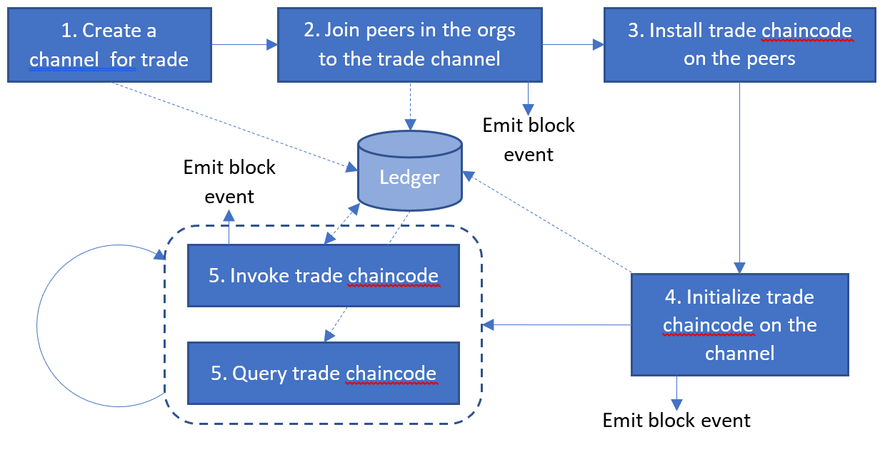

# Middleware to Expose Trade Channel and Chaincode Capabilities (based on Fabric SDK Node)
To run the [trade chaincode](../chaincde/) on the network created in [network](../network/), we need to
perform a sequence of bootstrapping and configuration operations. Any application that wraps the trade
smart contract must have the capabilities to run those operations through an API. Hyperledger Fabric
provides an SDK with library functions and an API for all the various primitives necessary to operate a
channel and exercise a chaincode on that channel.

The middleware code consists of various wrapper functions that harness the Fabric SDK primitives (in the
Node JS language) to run operations specific to our trade network and chaincode, and expose a high-level
API that can be used by a standard [web application](../application/).

# Network Bootstrapping and Transaction Pipeline
The sequence of operations that need to be performed are as follows:
- Create a trade channel (or blockchain instance)
- Join peers of all the organizations to this channel
- Install the [chaincode](../chaincode/) on every peer joined to the channel
- Instantiate the chaincode on this channel
- Expose Node JS API to invoke and query the trade chaincode

# Pre-requisites to Exercise the Middleware and Run the Test Scripts
Run `npm install` to install the dependencies.

# Configuring the Middleware
The `config.json` file contains a specification of the network that will be used to host the tarde channel and chaincode.
Make sure the parameters (hostnames, ports, etc.) match those in the [network](../network/) folder.

The `constants.js` file contains various parameters that dictate how the application will behave, such as the endorsement policy.
Make sure that the chaincode paths are accurate (they should be relative to the folder `../chaincode/src/`.)
Make sure that the channel ID (`tradechannel`) matches that used to create channel artifacts in the [network](../network/) folder.

# Test Run to Create a Trade Instance Using the Smart Contract
Run `node createTradeApp.js`.
This script runs through the stages from channel creation through to chaincode instantiation.
It then runs a chaincode invocation to create a trade request on behalf of the importer, and then queries the chaincode for the trade status.

# Test Run to Complete a Trade Contract Lifecycle after Setup
Run `node runTradeScenarioApp.js`.
This assumes that the `createTradeApp.js` script has run successfully.
It continues the trade smart contract lifecycle through to completion, as described in the [use case document](../docs/Use-Case-Description.docx).
The parameters supplied in the various chaincode invocations match those in the
[chaincode unit tests](../chaincode/src/github.com/trade_workflow/tradeWorkflow_test.go).

# Test Run to Add a New Organization to the Network
*Instructions to be added*

# Test Run to Upgrade the Chaicode
*Instructions to be added*
